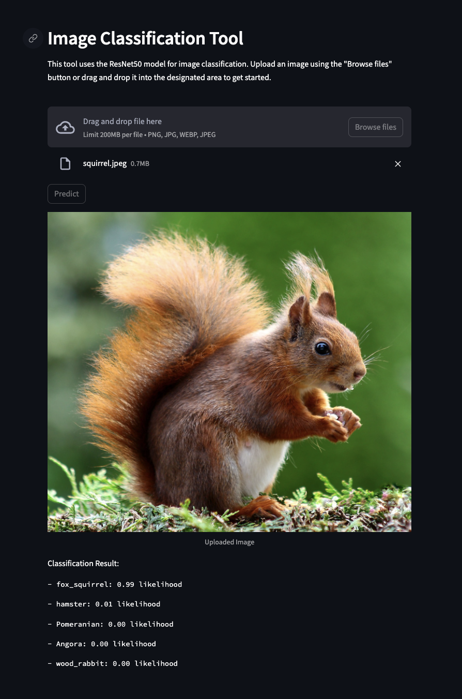

# Image Classification Tool

The Image Classification Tool is a web application that utilizes the ResNet50 model for image classification. It allows users to upload an image and get predictions for the objects present in the image along with their likelihood.

## Features

- Upload images in PNG, JPEG, WebP, or JPEG format.
- Utilizes a pre-trained ResNet50 model for image classification.
- Displays classification results with object names and likelihood scores.



## Technologies Used

- [FastAPI](https://fastapi.tiangolo.com/): Backend framework for serving the machine learning model as a RESTful API.
- [Streamlit](https://streamlit.io/): Frontend framework for building the web interface.
- [Docker](https://www.docker.com/): Containerization for easy deployment and scalability.
- [TensorFlow/Keras](https://www.tensorflow.org/): Used for loading the pre-trained ResNet50 model and making predictions.
- [OpenCV](https://opencv.org/): Library for image processing and manipulation.

## Security
- **File Upload Validation**: Added validation to ensure that only images in PNG, JPEG, WebP, or JPEG format are accepted, and their size does not exceed a certain limit.

## Setup

1. Clone the repository:
```bash
git clone https://github.com/YehSweeKhim/Image-Classification-Tool.git
```

2. Navigate to the project directory:
```bash
cd Image-Classification-Tool
```

3. Build and run the Docker containers:
```bash
docker-compose up --build
```

3. Access the Web Application: Once the Docker containers are running, you can access the web application in your browser:
- FastAPI backend: http://localhost:8000/docs
- Streamlit frontend: http://localhost:8501

## Usage

- Upload an image using the "Browse files" button or drag and drop it into the designated area.
- Click the "Predict" button to classify the uploaded image.
- View the classification results displayed below the uploaded image.

## Directory Structure

- **app.py**: FastAPI backend code for object classification.
- **main.py**: Streamlit frontend code for user interaction.
- **Dockerfile**: Dockerfile for building Docker images.
- **docker-compose.yml**: Docker Compose configuration for running multiple services.
- **requirements.txt**: List of Python dependencies for the project.